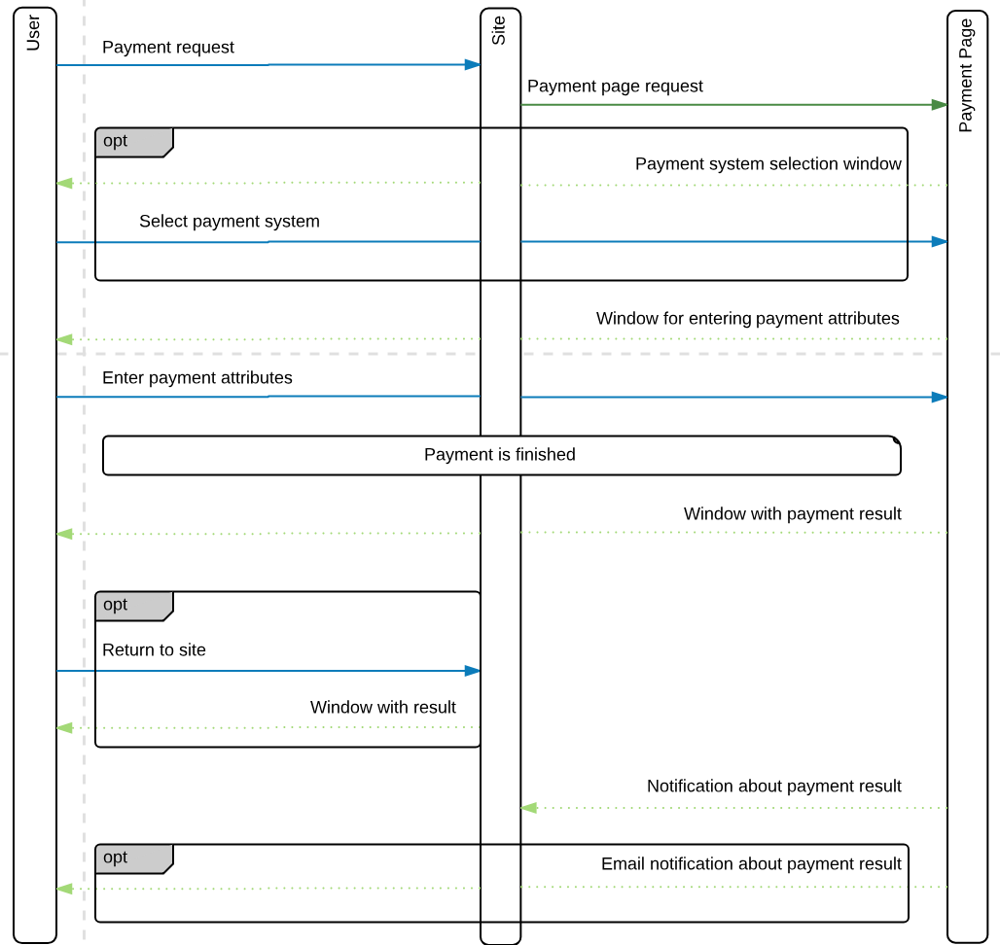

# ZtxPoint payment page SDK

This is a set of libraries in the Python language to ease integration of your service
with the ZtxPoint Payment Page.

Please note that for correct SDK operating you must have at least Python 3.5.  

## Payment flow



## Installation

Install with pip
```bash
pip install ztxpoint-sdk
```

### Get URL for payment

```python
from payment_page_sdk.gate import Gate
from payment_page_sdk.payment import Payment

gate = Gate('secret')
payment = Payment('402')
payment.payment_id = 'some payment id'
payment.payment_amount = 1001
payment.payment_currency = 'USD'
base_url = 'http://your_pp_url'
payment_url = gate.get_purchase_payment_page_url(base_url, payment)
# payment_url = gate.get_purchase_payment_page_url(base_url, payment, 'encryption_key') - for necrypted url
``` 
Для шифрования урла желательно использовать ключ не менее 16 символов.
В случае, если потребуется шифрование урла, то будет необходимо установить библиотеку pycryptodome 

```
pip install pycryptodome
```

`payment_url` here is the signed URL.

### Handle callback

You'll need to autoload this code in order to handle notifications:

```python
from payment_page_sdk.gate import Gate

gate = Gate('secret')
callback = gate.handle_callback(data)
```

`data` is the JSON data received from payment system;

`callback` is the Callback object describing properties received from payment system;
`callback` implements these methods: 
1. `callback.get_payment_status()`
    Get payment status.
2. `callback.get_payment()`
    Get all payment data.
3. `callback.get_payment_id()`
    Get payment ID in your system.